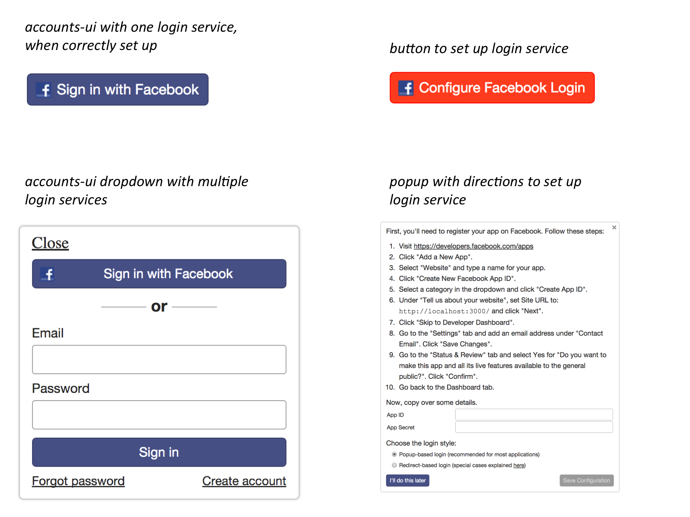

After reading this article, you'll know:

이 기사를 읽고 나면 다음과 같은 사실을 알게 될 것입니다.

1. What features in core Meteor enable user accounts
1. How to use accounts-ui for a quick prototype
1. How to use the useraccounts family of packages to build your login UI
1. How to build a fully-featured password login experience
1. How to enable login through OAuth providers like Facebook
1. How to add custom data to Meteor's users collection
1. How to manage user roles and permissions


1. Meteor 코어에서 사용자 계정을 활성화하는 기능
2. 빠른 프로토 타입을 위해 accounts-ui를 사용하는 방법
3. useraccounts 패키지 패밀리를 사용하여 로그인 UI를 작성하는 방법
4. 모든 기능을 갖춘 비밀번호 로그인 경험을 구축하는 방법
5. Facebook과 같은 OAuth 공급자를 통한 로그인 사용 설정 방법
6. Meteor의 사용자 컬렉션에 맞춤 데이터를 추가하는 방법
7. 사용자 역할 및 사용 권한을 관리하는 방법

<h2 id="core-meteor">Features in core Meteor</h2>

<h2 id="core-meteor">Meteor코어에서의 기능</h2>

Before we get into all of the different user-facing accounts functionality you can add with Meteor, let's go over some of the features built into the Meteor DDP protocol and `accounts-base` package. These are the parts of Meteor that you'll definitely need to be aware of if you have any user accounts in your app; most of everything else is optional and added/removed via packages.

Meteor로 추가 할 수있는 다양한 사용자 지향 계정 기능을 사용하기 전에 Meteor DDP 프로토콜과 계정 기반 패키지에 내장 된 기능 중 일부를 살펴 보겠습니다. Meteor의 일부로, 앱에 사용자 계정이 있다면 꼭 알아야 할 것입니다. 그 밖의 대부분은 선택 사항이며 패키지를 통해 추가 / 제거됩니다.

<h3 id="userid-ddp">userId in DDP</h3>

<h3 id="userid-ddp">DDP에서 userId</h3>

DDP is Meteor's built-in pub/sub and RPC protocol. You can read about how to use it in the [Data Loading](data-loading.html) and [Methods](methods.html) articles. In addition to the concepts of data loading and method calls, DDP has one more feature built in - the idea of a `userId` field on a connection. This is the place where login state is tracked, regardless of which accounts UI package or login service you are using.

DDP는 Meteor에 내장 된 pub / sub 및 RPC 프로토콜입니다. [Data Loading](data-loading.html) 및 [Methods](methods.html) 기사에서 이 정보를 사용하는 방법을 읽을 수 있습니다. 데이터 로딩과 메소드 호출의 개념 외에도 DDP에는 하나의 추가 기능, 즉 연결시 userId 필드 아이디어가 내장되어 있습니다. 이것은 사용중인 UI 패키지 또는 로그인 서비스에 관계없이 로그인 상태가 추적되는 곳입니다.

This built-in feature means that you always get `this.userId` inside Methods and Publications, and can access the user ID on the client. This is a great starting point for building your own custom accounts system, but most developers won't need to worry about the mechanics, since you'll mostly be interacting with the `accounts-base` package instead.

이 내장 기능은 메소드 및 출판물 내에 항상 `this.userId`를 가져오고 클라이언트의 사용자 ID에 액세스 할 수 있음을 의미합니다. 이것은 자신 만의 맞춤 계정 시스템을 구축하기위한 좋은 출발점이지만 대부분의 개발자는 대신 `accounts-base` 패키지와 상호 작용할 것이기 때문에 기계에 대해 걱정할 필요가 없습니다.

<h3 id="accounts-base">`accounts-base`</h3>

<h3 id="accounts-base">`accounts-base`</h3>

This package is the core of Meteor's developer-facing user accounts functionality. This includes:

이 패키지는 Meteor의 개발자 용 사용자 계정 기능의 핵심입니다. 여기에는 다음이 포함됩니다 :

1. A users collection with a standard schema, accessed through [`Meteor.users`](http://docs.meteor.com/#/full/meteor_users), and the client-side singletons [`Meteor.userId()`](http://docs.meteor.com/#/full/meteor_userid) and [`Meteor.user()`](http://docs.meteor.com/#/full/meteor_user), which represent the login state on the client.
2. A variety of helpful other generic methods to keep track of login state, log out, validate users, etc. Visit the [Accounts section of the docs](http://docs.meteor.com/#/full/accounts_api) to find a complete list.
3. An API for registering new login handlers, which is used by all of the other accounts packages to integrate with the accounts system. There isn't any official documentation for this API, but you can [read more about it on the MeteorHacks blog](https://meteorhacks.com/extending-meteor-accounts).


1. Meteor.users를 통해 액세스 할 수있는 표준 스키마가있는 사용자 컬렉션과 클라이언트의 로그인 상태를 나타내는 Meteor.userId () 및 Meteor.user ()가있는 클라이언트 측 싱글 톤.
2. 로그인 상태를 추적하고, 로그 아웃하고, 사용자의 유효성을 검사하는 등의 유용한 기타 다양한 일반적인 방법입니다. 전체 목록을 확인하려면 문서의 계정 섹션을 방문하십시오.
3. 계정 시스템과 통합하기 위해 다른 모든 계정 패키지가 사용하는 새로운 로그인 처리기를 등록하기위한 API입니다. 이 API에 대한 공식 문서는 없지만 MeteorHacks 블로그에서 자세한 내용을 읽을 수 있습니다.


Usually, you don't need to include `accounts-base` yourself since it's added for you if you use `accounts-password` or similar, but it's good to be aware of what is what.

일반적으로 `accounts-password` 등을 사용하면 `accounts-base`이 추가되기 때문에 계정 기반을 포함 할 필요가 없지만 무엇이 무엇인지 알고있는 것이 좋습니다.

<h2 id="accounts-ui">Fast prototyping with `accounts-ui`</h2>

<h2 id="accounts-ui">`accounts-ui`로 빠른 프로토 타이핑</h2>

Often, a complicated accounts system is not the first thing you want to build when you're starting out with a new app, so it's useful to have something you can just drop in quickly. This is where `accounts-ui` comes in - it's just one line that you drop into your app to get an accounts system. To add it:

복잡한 계정 시스템은 새로운 앱을 처음 시작할 때 가장 먼저 구축하는 것이 아니기 때문에 신속하게 삭제할 수있는 것이 유용합니다. 이것은 accounts-ui가 들어오는 곳입니다. 계정 시스템을 만들기 위해 앱에 드롭하는 것은 한 줄에 불과합니다. 그것을 추가하려면 :

```js
meteor add accounts-ui
```

Then just include it anywhere in a Blaze template:

그런 다음 Blaze 템플릿의 아무 곳에 나 포함 시키십시오.

```html
{{> loginButtons}}
```

Then, make sure to pick a login provider; they will automatically integrate with `accounts-ui`:

그런 다음 로그인 공급자를 선택하십시오. 자동으로 `accounts-ui`와 통합됩니다.

```sh
# pick one or more of the below
meteor add accounts-password
meteor add accounts-facebook
meteor add accounts-google
meteor add accounts-github
meteor add accounts-twitter
meteor add accounts-meetup
meteor add accounts-meteor-developer
```

Now just open your app, follow the configuration steps, and you're good to go - if you've done the [Meteor tutorial](https://www.meteor.com/tutorials/blaze/adding-user-accounts), you've already seen this in action. Of course, in a production application, you probably want a more custom user interface and some logic to have a more tailored UX, but that's why we have the rest of this guide.

이제 앱을 열고 설정 단계를 따라하면됩니다. Meteor 튜토리얼을 완료했다면, 이미 실제로 보았을 것입니다. 물론 프로덕션 응용 프로그램에서는 더 많은 사용자 정의 사용자 인터페이스와 일부 논리가 더 맞춤화 된 UX를 갖기를 원하지만이 가이드의 나머지 부분이 있습니다.

Here are a couple of screenshots of `accounts-ui` so you know what to expect:

다음은 몇 가지 계정 캡쳐 화면입니다.



<h2 id="useraccounts">Customizable UI: useraccounts</h2>

<h2 id="useraccounts">사용자 정의 UI : useraccounts</h2>

Once you've gotten your initial prototype up and running with `accounts-ui`, you'll want to move to something more powerful and configurable so that you can better integrate your login flow with the rest of your app. The [`useraccounts` family of packages](https://github.com/meteor-useraccounts/core/blob/master/Guide.md) is the most powerful set of accounts management UI controls available for Meteor today. If you need even more customization, you can also roll your own system, but it's worth trying `useraccounts` first.

초기 프로토 타입을 만들고 accounts-ui로 실행 한 후에는 더 강력하고 구성 가능한 것으로 이동하여 로그인 흐름을 나머지 앱과보다 잘 통합 할 수 있습니다. 패키지의 useraccounts 패밀리는 오늘날 Meteor에서 사용할 수있는 가장 강력한 계정 관리 UI 컨트롤 집합입니다. 더 많은 사용자 정의가 필요하다면 자체 시스템을 롤업 할 수도 있지만 먼저 사용자 계정을 시험해 보는 것이 좋습니다.

<h3 id="useraccounts-flexibility">Use any router or UI framework</h3>

<h3 id="useraccounts-flexibility">라우터 또는 UI 프레임 워크 사용</h3>

The first thing to understand about `useraccounts` is that the core accounts management logic is independent of the HTML templates and routing packages. This means you can use [`useraccounts:core`](https://atmospherejs.com/useraccounts/core) to build your own set of login templates. Generally, you'll want to pick one login template package and one login routing package. The options for templates include:

- [`useraccounts:unstyled`](https://atmospherejs.com/useraccounts/unstyled) which lets you bring your own CSS; this one is used in the Todos example app to make the login UI blend seamlessly with the rest of the app.
- Pre-built templates for [Bootstrap, Semantic UI, Materialize, and more](https://github.com/meteor-useraccounts/core/blob/master/Guide.md#available-versions). These templates don't come with the actual CSS framework, so you can pick your favorite Bootstrap package, for example.


`useraccounts에` 대해 가장 먼저 이해해야 할 핵심 계정 관리 논리는 HTML 템플릿 및 라우팅 패키지와 별개입니다. 즉, [`useraccounts:core`](https://atmospherejs.com/useraccounts/core)를 사용하여 고유 한 로그인 템플릿 세트를 만들 수 있습니다. 일반적으로 하나의 로그인 템플릿 패키지와 하나의 로그인 라우팅 패키지를 선택하려고합니다. 템플릿 옵션에는 다음이 포함됩니다.

- [`useraccounts:unstyled`](https://atmospherejs.com/useraccounts/unstyled)를 사용하면 자신 만의 CSS를 가져올 수 있습니다. 이 응용 프로그램은 Todos 예제 응용 프로그램에서 로그인 UI가 나머지 응용 프로그램과 원활하게 조화되도록하기 위해 사용됩니다.
- [Bootstrap, Semantic UI, Materialize, and more](https://github.com/meteor-useraccounts/core/blob/master/Guide.md#available-versions)등을위한 사전 제작 된 템플릿. 이러한 템플릿은 실제 CSS 프레임 워크와 함께 제공되지 않으므로 선호하는 Bootstrap 패키지를 선택할 수 있습니다.


While it's optional and the basic functionality will work without it, it's also a good idea to pick a router integration:

선택 사항이지만 기본 기능이 없으면 작동하지만 라우터 통합을 선택하는 것도 좋은 방법입니다.

- [Flow Router](https://atmospherejs.com/useraccounts/flow-routing), the router [recommended in this guide](routing.html).
- [Iron Router](https://atmospherejs.com/useraccounts/iron-routing), another popular router in the Meteor community.

- [Flow Router](https://atmospherejs.com/useraccounts/flow-routing), 이 가이드에서 권장하는 라우터.
- [Iron Router](https://atmospherejs.com/useraccounts/iron-routing), Meteor 커뮤니티에서 인기있는 라우터입니다.

In the example app we are using the Flow Router integration with great success. Some of the later sections will cover how to customize the routes and templates to fit your app better.

예제 애플 리케이션에서 우리는 큰 성공과 함께 흐름 라우터 통합을 사용하고 있습니다. 이후 섹션 중 일부는 앱에 더 잘 맞도록 경로와 템플릿을 맞춤 설정하는 방법에 대해 설명합니다.

<h3 id="useraccounts-drop-in">Drop-in UI without routing</h3>

<h3 id="useraccounts-drop-in">라우팅없는 드롭 인 UI</h3>

If you don't want to configure routing for your login flow, you can just drop in a self-managing accounts screen. Wherever you want the accounts UI template to render, just include the `atForm` template, like so:

로그인 흐름에 대한 라우팅을 구성하지 않으려면 자체 관리 계정 화면을 드롭하면됩니다. 계정 UI 템플릿을 렌더링하려는 곳이면 어디서나 atForm 템플릿을 포함하면됩니다.

```html
{{> atForm}}
```

Once you configure routing according to [the section below](#useraccounts-customizing-routes), you'll want to remove this inclusion.

[아래 섹션](#useraccounts-customizing-routes)에 따라 라우팅을 구성한 후에는이 포함을 제거해야합니다.

<h3 id="useraccounts-customizing-templates">Customizing templates</h3>

<h3 id="useraccounts-customizing-templates">사용자정의 템플릿</h3>

For some apps, the off-the-shelf login templates provided by the various `useraccounts` UI packages will work as-is, but most apps will want to customize some of the presentation. There's a simple way to do that using the template replacement functionality of the `aldeed:template-extension` package.

First, figure out which template you want to replace by looking at the source code of the package. For example, in the `useraccounts:unstyled` package, the templates are listed [in this directory on GitHub](https://github.com/meteor-useraccounts/unstyled/tree/master/lib). By squinting at the file names and looking for some of the HTML strings, we can figure out that we might be interested in replacing the `atPwdFormBtn` template. Let's take a look at the original template:

일부 앱의 경우 다양한 `useraccounts` UI 패키지에서 제공하는 상용 로그인 템플릿이 그대로 작동하지만 대부분의 앱에서는 일부 프리젠 테이션을 맞춤 설정하려고합니다. `aldeed : template-extension`패키지의 템플리트 대체 기능을 사용하여이를 수행하는 간단한 방법이 있습니다.

먼저 패키지의 소스 코드를보고 대체 할 템플릿을 찾습니다. 예를 들어, useraccounts : unstyled 패키지에서 템플릿은 [GitHub의이 디렉토리](https://github.com/meteor-useraccounts/unstyled/tree/master/lib)에 나열됩니다. 파일 이름을 squinting하고 HTML 문자열 중 일부를 찾아서 `atPwdFormBtn` 템플릿을 대체 할 수 있는지 알아볼 수 있습니다. 원래 템플릿을 살펴 보겠습니다.


```html
<template name="atPwdFormBtn">
  <button type="submit" class="at-btn submit {{submitDisabled}}" id="at-btn">
    {{buttonText}}
  </button>
</template>
```

Once you've identified which template you need to replace, define a new template. In this case, we want to modify the class on the button to work with the CSS for the rest of the app. There are a few things to keep in mind when overriding a template:

1. Render the helpers in the same way the previous template did. In this case we are using `buttonText`.
2. Keep any `id` attributes, like `at-btn`, since those are used for event handling.

Here's what our new override template looks like:

바꿀 필요가있는 템플릿을 찾았 으면 새 템플릿을 정의하십시오. 이 경우 버튼의 클래스를 수정하여 나머지 앱에서 CSS를 사용하려고합니다. 템플릿을 재정의 할 때 유의해야 할 몇 가지 사항이 있습니다.

1. 이전 템플릿과 동일한 방식으로 도우미를 렌더링하십시오.
2. 이 경우 buttonText를 사용하고 있습니다. `at-btn`과 같은 `id` 속성은 이벤트 처리에 사용되므로 보관하십시오.

새 재정의 템플릿은 다음과 같습니다.

```html
<template name="override-atPwdFormBtn">
  <button type="submit" class="btn-primary" id="at-btn">
    {{buttonText}}
  </button>
</template>
```

Then, use the `replaces` function on the template to override the existing template from `useraccounts`:

그런 다음 템플릿의 대체 함수를 사용하여 useraccounts에서 기존 템플릿을 재정의합니다.

```js
Template['override-atPwdFormBtn'].replaces('atPwdFormBtn');
```

<h3 id="useraccounts-customizing-routes">Customizing routes</h3>

<h3 id="useraccounts-customizing-routes">사용자정의 경로</h3>

In addition to having control over the templates, you'll want to be able to control the routing and URLs for the different views offered by `useraccounts`. Since Flow Router is the officially recommended routing option for Meteor, we'll go over that in particular.

First, we need to configure the layout we want to use when rendering the accounts templates:

템플릿을 제어하는 ​​것 외에도 useraccounts가 제공하는 여러보기의 라우팅과 URL을 제어 할 수 있어야합니다. Flow Router는 Meteor에 공식적으로 권장되는 라우팅 옵션이므로 특별히 살펴 보겠습니다.

먼저 계정 템플릿을 렌더링 할 때 사용할 레이아웃을 구성해야합니다.


```js
AccountsTemplates.configure({
  defaultTemplate: 'Auth_page',
  defaultLayout: 'App_body',
  defaultContentRegion: 'main',
  defaultLayoutRegions: {}
});
```

In this case, we want to use the `App_body` layout template for all of the accounts-related pages. This template has a content region called `main`. Now, let's configure some routes:

이 경우 모든 계정 관련 페이지에 대해 `App_body` 레이아웃 템플릿을 사용하려고합니다. 이 템플리트에는 `main`이라는 컨텐츠 영역이 있습니다. 이제 몇 가지 경로를 구성 해 보겠습니다.


```js
// Define these routes in a file loaded on both client and server
AccountsTemplates.configureRoute('signIn', {
  name: 'signin',
  path: '/signin'
});

AccountsTemplates.configureRoute('signUp', {
  name: 'join',
  path: '/join'
});

AccountsTemplates.configureRoute('forgotPwd');

AccountsTemplates.configureRoute('resetPwd', {
  name: 'resetPwd',
  path: '/reset-password'
});
```

Note that we have specified a password reset route. Normally, we would have to configure Meteor's accounts system to send this route in password reset emails, but the `useraccounts:flow-routing` package does it for us. [Read more about configuring email flows below.](#email-flows)

우리는 암호 재설정 경로를 지정했습니다. 일반적으로, 우리는 암호 재설정 전자 메일에서이 경로를 보내도록 Meteor의 계정 시스템을 구성해야하지만, `useraccounts : flow-routing` 패키지는이를 처리합니다. [아래에서 이메일 흐름 구성에 대해 자세히 알아보십시오.](#email-flows)

Now that the routes are setup on the server, they can be accessed from the browser (e.g. `example.com/reset-password`).  To create links to these routes in a template, it's best to use a helper method provided by the router.  For Flow Router, the [`arillo:flow-router-helpers`](https://github.com/arillo/meteor-flow-router-helpers/) package provides a `pathFor` helper for just this purpose.  Once installed, the following is possible in a template:

이제 경로가 서버에 설정되었으므로 브라우저에서 해당 경로에 액세스 할 수 있습니다 (예 : `example.com/reset-password`). 템플릿에서 이러한 경로에 대한 링크를 만들려면 라우터가 제공하는 도우미 방법을 사용하는 것이 가장 좋습니다. 플로우 라우터의 경우, [`arillo:flow-router-helpers`](https://github.com/arillo/meteor-flow-router-helpers/) 패키지는이 목적을 위해 `pathFor` 헬퍼를 제공합니다. 설치되면 템플릿에서 다음을 수행 할 수 있습니다.

```html
<div class="btns-group">
  <a href="{{pathFor 'signin'}}" class="btn-secondary">Sign In</a>
  <a href="{{pathFor 'join'}}" class="btn-secondary">Join</a>
</div>
```

You can find a complete list of different available routes in the [documentation the `useraccounts:flow-routing`](https://github.com/meteor-useraccounts/flow-routing#routes).

[문서 `useraccounts:flow-routing`](https://github.com/meteor-useraccounts/flow-routing#routes)에서 사용 가능한 경로의 전체 목록을 찾을 수 있습니다.

<h3 id="useraccounts-further-customization">Further customization</h3>

<h3 id="useraccounts-further-customization">추가 맞춤 설정</h3>

`useraccounts` offers many other customization options beyond templates and routing. Read the [`useraccounts` guide](https://github.com/meteor-useraccounts/core/blob/master/Guide.md) to learn about all of the other options.

`useraccounts는` 템플릿 및 라우팅 이외에도 많은 다른 사용자 지정 옵션을 제공합니다. 다른 모든 옵션에 대해 알아 보려면 사용자 계정 가이드를 읽으십시오.

<h2 id="accounts-password">Password login</h2>

<h2 id="accounts-password">비밀번호 로그인 </h2>

Meteor comes with a secure and fully-featured password login system out of the box. To use it, add the package:

Meteor는 안전하고 완벽한 기능의 암호 로그인 시스템을 기본 제공합니다. 그것을 사용하려면 패키지를 추가하십시오 :

```sh
meteor add accounts-password
```

To see what options are available to you, read the complete description of the [`accounts-password` API in the Meteor docs](http://docs.meteor.com/#/full/accounts_passwords).

어떤 옵션을 사용할 수 있는지 확인하려면 [Meteor문서의 `accounts-password` API](http://docs.meteor.com/#/full/accounts_passwords)에 대한 전체 설명을 읽으십시오.

<h3 id="requiring-username-email">Requiring username or email</h3>

<h3 id="requiring-username-email">사용자 이름(username) 또는 이메일 요구</h3>

> Note: You don't have to do this if you're using `useraccounts`. It disables the regular Meteor client-side account creation functions for you and does custom validation.

> 참고 : `useraccounts`를 사용하는 경우에는이 작업을 수행 할 필요가 없습니다. 정기적 인 Meteor 클라이언트 측 계정 작성 기능을 사용하지 않으며 사용자 정의 유효성 검증을 수행합니다.

By default, the `Accounts.createUser` function provided by `accounts-password` allows you to create an account with a username, email, or both. Most apps expect a specific combination of the two, so you will certainly want to validate the new user creation:

기본적으로 `accounts-password`패키지에서 제공되는 `Accounts.createUser` 함수를 사용하면 사용자 이름, 전자 메일 또는 둘 다를 사용하여 계정을 만들 수 있습니다. 대부분의 앱은이 둘의 특정 조합을 기대하므로 확실히 새로운 사용자 생성을 검증해야합니다.

```js
// Ensuring every user has an email address, should be in server-side code
Accounts.validateNewUser((user) => {
  new SimpleSchema({
    _id: { type: String },
    emails: { type: Array },
    'emails.$': { type: Object },
    'emails.$.address': { type: String },
    'emails.$.verified': { type: Boolean },
    createdAt: { type: Date },
    services: { type: Object, blackbox: true }
  }).validate(user);

  // Return true to allow user creation to proceed
  return true;
});
```

<h3 id="multiple-emails">Multiple emails</h3>

<h3 id="multiple-emails">여러 개의 이메일</h3>

Often, users might want to associate multiple email addresses with the same account. `accounts-password` addresses this case by storing the email addresses as an array in the user collection. There are some handy API methods to deal with [adding](http://docs.meteor.com/api/passwords.html#Accounts-addEmail), [removing](http://docs.meteor.com/api/passwords.html#Accounts-removeEmail), and [verifying](http://docs.meteor.com/api/passwords.html#Accounts-verifyEmail) emails.

종종 사용자는 여러 이메일 주소를 동일한 계정에 연결할 수 있습니다. `accounts-password`는 전자 메일 주소를 사용자 컬렉션에 배열로 저장하여이 경우를 해결합니다. 이메일 [추가](http://docs.meteor.com/api/passwords.html#Accounts-addEmail), [삭제](http://docs.meteor.com/api/passwords.html#Accounts-removeEmail) 및 [확인](http://docs.meteor.com/api/passwords.html#Accounts-verifyEmail)을 처리 할 수있는 편리한 API 메소드가 있습니다.

One useful thing to add for your app can be the concept of a "primary" email address. This way, if the user has added multiple emails, you know where to send confirmation emails and similar.

앱에 추가 할 수있는 유용한 기능 중 하나는 "기본"이메일 주소의 개념 일 수 있습니다. 사용자가 여러 개의 전자 메일을 추가 한 경우 이렇게하면 확인 전자 메일 등을 보낼 위치를 알 수 있습니다.

<h3 id="case-sensitivity">Case sensitivity</h3>

<h3 id="case-sensitivity">대소 문자 구분</h3>

Before Meteor 1.2, all email addresses and usernames in the database were considered to be case-sensitive. This meant that if you registered an account as `AdaLovelace@example.com`, and then tried to log in with `adalovelace@example.com`, you'd see an error indicating that no user with that email exists. Of course, this can be quite confusing, so we decided to improve things in Meteor 1.2. But the situation was not as simple as it seemed; since MongoDB doesn't have a concept of case-insensitive indexes, it was impossible to guarantee unique emails at the database level. For this reason, we have some special APIs for querying and updating users which manage the case-sensitivity problem at the application level.

 Meteor 1.2 이전에는 데이터베이스의 모든 이메일 주소와 사용자 이름이 대소 문자를 구별하는 것으로 간주되었습니다. 즉, AdaLovelace@example.com으로 계정을 등록하고 adalovelace@example.com으로 로그인을 시도하면 해당 이메일을 가진 사용자가 없음을 나타내는 오류가 표시됩니다. 물론 이것은 매우 혼란 스러울 수 있으므로 우리는 Meteor 1.2에서 개선하기로 결정했습니다. 그러나 상황은 그렇게 단순하지 않았습니다. MongoDB에는 대소 문자를 구분하지 않는 인덱스 개념이 없기 때문에 데이터베이스 수준에서 고유 한 전자 메일을 보장하는 것은 불가능했습니다. 이러한 이유로 응용 프로그램 수준에서 대 / 소문자 구분 문제를 관리하는 사용자 쿼리 및 업데이트를위한 몇 가지 특수 API가 있습니다.

<h4 id="case-sensitivity-in-my-app">What does this mean for my app?</h4>

<h4 id="case-sensitivity-in-my-app">내 앱의 의미는 무엇입니까?</h4>

Just follow one simple rule: don't query the database by `username` or `email` directly. Instead, use the [`Accounts.findUserByUsername`](http://docs.meteor.com/api/passwords.html#Accounts-findUserByUsername) and [`Accounts.findUserByEmail`](http://docs.meteor.com/api/passwords.html#Accounts-findUserByEmail) methods provided by Meteor. This will run a query for you that is case-insensitive, so you will always find the user you are looking for.

하나의 간단한 규칙을 따르십시오. `username`이나 `email`로 데이터베이스를 직접 쿼리하지 마십시오. 대신 Meteor에서 제공하는 [`Accounts.findUserByUsername`](http://docs.meteor.com/api/passwords.html#Accounts-findUserByUsername) 및 [`Accounts.findUserByEmail`](http://docs.meteor.com/api/passwords.html#Accounts-findUserByEmail) 메소드를 사용하십시오. 이렇게하면 대 / 소문자를 구분하지 않는 쿼리가 실행되므로 찾고있는 사용자를 항상 찾을 수 있습니다.

<h3 id="email-flows">Email flows</h3>

<h3 id="email-flows">이메일 흐름</h3>

When you have a login system for your app based on user emails, that opens up the possibility for email-based account flows. The common thing between all of these workflows is that they involve sending a unique link to the user's email address, which does something special when it is clicked. Let's look at some common examples that Meteor's `accounts-password` package supports out of the box:

1. **Password reset.** When the user clicks the link in their email, they are taken to a page where they can enter a new password for their account.
1. **User enrollment.** A new user is created by an administrator, but no password is set. When the user clicks the link in their email, they are taken to a page where they can set a new password for their account. Very similar to password reset.
1. **Email verification.** When the user clicks the link in their email, the application records that this email does indeed belong to the correct user.

Here, we'll talk about how to manage the whole process manually from start to finish.

사용자 전자 메일을 기반으로하는 앱 로그인 시스템을 사용하면 전자 메일 기반 계정 흐름이 가능합니다. 이러한 모든 워크 플로의 공통점은 사용자의 전자 메일 주소에 고유 한 링크를 보내는 것인데, 클릭 할 때 특별한 작업을 수행한다는 것입니다. Meteor의 계정 - 비밀번호 패키지가 기본적으로 지원하는 몇 가지 일반적인 예를 살펴 보겠습니다.

1. **비밀번호 초기화.** 사용자가 이메일의 링크를 클릭하면 해당 페이지의 새 비밀번호를 입력 할 수있는 페이지로 이동합니다.
1. **사용자 등록.** 새 사용자는 관리자가 만들지 만 암호는 설정하지 않습니다. 사용자가 이메일의 링크를 클릭하면 해당 페이지의 새 비밀번호를 설정할 수있는 페이지로 이동합니1다. 암호 재설정과 매우 유사합니다.
1. **이메일 확인.** 사용자가 전자 메일의 링크를 클릭하면 응용 프로그램은이 전자 메일이 실제로 올바른 사용자의 것임을 기록합니다.

여기서는 시작부터 끝까지 수동으로 전체 프로세스를 관리하는 방법에 대해 설명합니다.

<h4 id="default-email-flow">Email works out of the box with accounts UI packages</h4>

<h4 id="default-email-flow">계정 UI 패키지로 이메일을 즉시 사용할 수 있습니다.</h4>

If you want something that just works out of the box, you can use `accounts-ui` or `useraccounts` which basically do everything for you. Only follow the directions below if you definitely want to build all parts of the email flow yourself.

기본적으로 상자 밖에서 작동하는 것을 원하면 기본적으로 모든 것을 수행하는 accounts-ui 또는 useraccounts를 사용할 수 있습니다. 직접 이메일 흐름의 모든 부분을 직접 만들고 싶다면 아래 지침을 따르십시오.

<h4 id="sending-email">Sending the email</h4>

<h4 id="sending-email">전자 메일 보내기</h4>

`accounts-password` comes with handy functions that you can call from the server to send an email. They are named for exactly what they do:

`accounts-password`에는 이메일을 보내기 위해 서버에서 호출 할 수있는 편리한 기능이 있습니다. 그들은 정확히 무엇을 위해 명명됩니다 :

1. [`Accounts.sendResetPasswordEmail`](http://docs.meteor.com/#/full/accounts_sendresetpasswordemail)
2. [`Accounts.sendEnrollmentEmail`](http://docs.meteor.com/#/full/accounts_sendenrollmentemail)
3. [`Accounts.sendVerificationEmail`](http://docs.meteor.com/#/full/accounts_sendverificationemail)

The email is generated using the email templates from [Accounts.emailTemplates](http://docs.meteor.com/#/full/accounts_emailtemplates), and include links generated with `Accounts.urls`. We'll go into more detail about customizing the email content and URL later.

1. [`Accounts.sendResetPasswordEmail`](http://docs.meteor.com/#/full/accounts_sendresetpasswordemail)
2. [`Accounts.sendEnrollmentEmail`](http://docs.meteor.com/#/full/accounts_sendenrollmentemail)
3. [`Accounts.sendVerificationEmail`](http://docs.meteor.com/#/full/accounts_sendverificationemail)

이메일은 [Accounts.emailTemplates](http://docs.meteor.com/#/full/accounts_emailtemplates)을 사용하여 생성되며 `Accounts.urls`로 생성 된 링크를 포함합니다. 나중에 이메일 내용과 URL을 맞춤 설정하는 방법에 대해 자세히 설명하겠습니다.

<h4 id="identifying-link-click">Identifying when the link is clicked</h4>

<h4 id="identifying-link-click">링크를 클릭 할 때 식별</h4>

When the user receives the email and clicks the link inside, their web browser will take them to your app. Now, you need to be able to identify these special links and act appropriately. If you haven't customized the link URL, then you can use some built-in callbacks to identify when the app is in the middle of an email flow.

사용자가 이메일을 수신하고 내부 링크를 클릭하면 웹 브라우저가 해당 이메일을 앱으로 가져옵니다. 이제 이러한 특수 링크를 식별하고 적절히 행동 할 수 있어야합니다. 링크 URL을 사용자 정의하지 않은 경우 내장 된 콜백을 사용하여 앱이 이메일 흐름의 중간에 있는지 확인할 수 있습니다.

Normally, when the Meteor client connects to the server, the first thing it does is pass the _login resume token_ to re-establish a previous login. However, when these callbacks from the email flow are triggered, the resume token is not sent until your code signals that it has finished handling the request by calling the `done` function that is passed into the registered callback. This means that if you were previously logged in as user A, and then you clicked the reset password link for user B, but then you cancelled the password reset flow by calling `done()`, the client would log in as A again.

일반적으로, Meteor 클라이언트가 서버에 연결할 때 가장 먼저하는 일은 _login resume token_ 을 전달하여 이전 로그인을 다시 설정하는 것입니다. 그러나 전자 메일 흐름의 이러한 콜백이 트리거 될 때 등록 된 콜백으로 전달 된 `done` 함수를 호출하여 요청 처리를 완료했다는 신호를 귀하의 코드에 보낼 때까지 다시 시작 토큰이 보내지지 않습니다. 즉, 이전에 사용자 A로 로그인 한 다음 사용자 B에 대한 비밀번호 재설정 링크를 클릭했지만 `done()`을 호출하여 비밀번호 재설정 흐름을 취소 한 경우 클라이언트는 다시 A로 로그인합니다.

1. [`Accounts.onResetPasswordLink`](http://docs.meteor.com/#/full/Accounts-onResetPasswordLink)
2. [`Accounts.onEnrollmentLink`](http://docs.meteor.com/#/full/Accounts-onEnrollmentLink)
3. [`Accounts.onEmailVerificationLink`](http://docs.meteor.com/#/full/Accounts-onEmailVerificationLink)

Here's how you would use one of these functions:

1. [`Accounts.onResetPasswordLink`](http://docs.meteor.com/#/full/Accounts-onResetPasswordLink)
2. [`Accounts.onEnrollmentLink`](http://docs.meteor.com/#/full/Accounts-onEnrollmentLink)
3. [`Accounts.onEmailVerificationLink`](http://docs.meteor.com/#/full/Accounts-onEmailVerificationLink)

다음은 이러한 함수 중 하나를 사용하는 방법입니다.


```js
Accounts.onResetPasswordLink((token, done) => {
  // Display the password reset UI, get the new password...

  Accounts.resetPassword(token, newPassword, (err) => {
    if (err) {
      // Display error
    } else {
      // Resume normal operation
      done();
    }
  });
})
```

If you want a different URL for your reset password page, you need to customize it using the `Accounts.urls` option:

재설정 된 비밀번호 페이지와 다른 URL을 원할 경우 `Accounts.urls` 옵션을 사용하여 맞춤 설정해야합니다.

```js
Accounts.urls.resetPassword = (token) => {
  return Meteor.absoluteUrl(`reset-password/${token}`);
};
```

If you have customized the URL, you will need to add a new route to your router that handles the URL you have specified, and the default `Accounts.onResetPasswordLink` and friends won't work for you.

URL을 사용자 정의한 경우 지정한 URL을 처리하는 라우터에 새 경로를 추가해야하며 기본 `Accounts.onResetPasswordLink` 및 친구는 작동하지 않습니다.

<h4 id="completing-email-flow">Displaying an appropriate UI and completing the process</h4>

<h4 id="completing-email-flow">적절한 UI 표시 및 프로세스 완료</h4>

Now that you know that the user is attempting to reset their password, set an initial password, or verify their email, you should display an appropriate UI to allow them to do so. For example, you might want to show a page with a form for the user to enter their new password.

When the user submits the form, you need to call the appropriate function to commit their change to the database. Each of these functions takes the new value and the token you got from the event in the previous step.

이제 사용자가 비밀번호 재설정, 초기 비밀번호 설정 또는 이메일 확인을 시도하고 있음을 알았으므로 적절한 UI를 표시해야합니다. 예를 들어 사용자가 새 비밀번호를 입력 할 수있는 양식이있는 페이지를 표시하고자 할 수 있습니다.

사용자가 양식을 제출하면 변경 사항을 데이터베이스에 적용하기 위해 적절한 함수를 호출해야합니다. 이러한 각 함수는 이전 단계의 이벤트에서 얻은 토큰과 새 값을 사용합니다.

1. [`Accounts.resetPassword`](http://docs.meteor.com/#/full/accounts_resetpassword) - this one should be used both for resetting the password, and enrolling a new user; it accepts both kinds of tokens.
2. [`Accounts.verifyEmail`](http://docs.meteor.com/#/full/accounts_verifyemail)

After you have called one of the two functions above or the user has cancelled the process, call the `done` function you got in the link callback. This will tell Meteor to get out of the special state it enters when you're doing one of the email account flows.

1. [`Accounts.resetPassword`](http://docs.meteor.com/#/full/accounts_resetpassword) - 암호를 다시 설정하고 새 사용자를 등록하는 데이 계정을 사용해야합니다. 두 종류의 토큰을 모두 허용합니다.
2.  [`Accounts.verifyEmail`](http://docs.meteor.com/#/full/accounts_verifyemail)

위의 두 함수 중 하나를 호출했거나 사용자가 프로세스를 취소 한 후 링크 콜백에있는 done 함수를 호출하십시오. 이렇게하면 Meteor가 전자 메일 계정 흐름 중 하나를 수행 할 때 입력되는 특수 상태를 벗어나게됩니다.

<h3 id="customizing-emails">Customizing accounts emails</h3>

<h3 id="customizing-emails">사용자 정의는 이메일 계정</h3>

You will probably want to customize the emails `accounts-password` will send on your behalf. This can be easily done through the [`Accounts.emailTemplates` API](http://docs.meteor.com/#/full/accounts_emailtemplates). Below is some example code from the Todos app:

계정 이메일 맞춤 설정 사용자를 대신하여 비밀번호가 전송하는 전자 메일 계정을 사용자 지정할 수 있습니다. 이는 Accounts.emailTemplates API를 통해 쉽게 수행 할 수 있습니다. 아래는 Todos 앱의 몇 가지 예제 코드입니다.

```js
Accounts.emailTemplates.siteName = "Meteor Guide Todos Example";
Accounts.emailTemplates.from = "Meteor Todos Accounts <accounts@example.com>";

Accounts.emailTemplates.resetPassword = {
  subject(user) {
    return "Reset your password on Meteor Todos";
  },
  text(user, url) {
    return `Hello!
Click the link below to reset your password on Meteor Todos.
${url}
If you didn't request this email, please ignore it.
Thanks,
The Meteor Todos team
`
  },
  html(user, url) {
    // This is where HTML email content would go.
    // See the section about html emails below.
  }
};
```

As you can see, we can use the ES2015 template string functionality to generate a multi-line string that includes the password reset URL. We can also set a custom `from` address and email subject.

보시다시피 ES2015 템플릿 문자열 기능을 사용하여 비밀번호 재설정 URL이 포함 된 여러 줄 문자열을 생성 할 수 있습니다. 또한 주소 및 이메일 제목을 사용하여 사용자 정의를 설정할 수 있습니다.

<h4 id="html-emails">HTML emails</h4>

<h4 id="html-emails">HTML 전자 메일</h4>

If you've ever needed to deal with sending pretty HTML emails from an app, you know that it can quickly become a nightmare. Compatibility of popular email clients with basic HTML features like CSS is notoriously spotty, so it is hard to author something that works at all. Start with a [responsive email template](https://github.com/leemunroe/responsive-html-email-template) or [framework](http://foundation.zurb.com/emails/email-templates.html), and then use a tool to convert your email content into something that is compatible with all email clients. [This blog post by Mailgun covers some of the main issues with HTML email.](http://blog.mailgun.com/transactional-html-email-templates/) In theory, a community package could extend Meteor's build system to do the email compilation for you, but at the time of writing we were not aware of any such packages.

앱에서 예쁜 HTML 이메일을 보내는 것에 대처해야 할 필요가 있다면, 그것이 곧 악몽이 될 수 있다는 것을 알고 있습니다. 인기있는 이메일 클라이언트와 CSS와 같은 기본 HTML 기능의 호환성은 악명이 높지 않으므로 전혀 작동하지 않는 무언가를 작성하기가 어렵습니다. [반응형 이메일 템플릿](https://github.com/leemunroe/responsive-html-email-template) 또는 [프레임 워크](http://foundation.zurb.com/emails/email-templates.html)로 시작한 다음 도구를 사용하여 이메일 콘텐츠를 모든 이메일 클라이언트와 호환되는 것으로 변환하십시오. Mailgun의이 블로그 게시물은 HTML 전자 메일의 주요 문제점 중 일부를 다룹니다. 이론적으로 커뮤니티 패키지는 Meteor의 빌드 시스템을 확장하여 이메일 컴파일을 할 수 있지만 작성 당시에는 그러한 패키지에 대해 알지 못했습니다.

<h2 id="oauth">OAuth login</h2>

<h2 id="oauth">OAuth 로그인</h2>

In the distant past, it could have been a huge headache to get Facebook or Google login to work with your app. Thankfully, most popular login providers have standardized around some version of [OAuth](https://en.wikipedia.org/wiki/OAuth), and Meteor supports some of the most popular login services out of the box.

먼 과거에는 페이스 북이나 구글 로그인이 앱과 함께 작동하도록하는 것이 큰 골칫거리였다. 고맙게도 가장 인기있는 로그인 제공 업체는 OAuth의 일부 버전을 표준화했으며 Meteor는 가장 인기있는 로그인 서비스를 즉시 지원합니다.

<h3 id="supported-login-services">Facebook, Google 등등</h3>

Here's a complete list of login providers for which Meteor actively maintains core packages:

1. Facebook with `accounts-facebook`
2. Google with `accounts-google`
3. GitHub with `accounts-github`
4. Twitter with `accounts-twitter`
5. Meetup with `accounts-meetup`
6. Meteor Developer Accounts with `accounts-meteor-developer`

There is a package for logging in with Weibo, but it is no longer being actively maintained.

Meteor가 핵심 패키지를 적극적으로 관리하는 로그인 제공 업체의 전체 목록은 다음과 같습니다.

1. Facebook `accounts-facebook`
2. Google `accounts-google`
3. GitHub `accounts-github`
4. Twitter `accounts-twitter`
5. Meetup `accounts-meetup`
6. Meteor 개발자 계정 `accounts-meteor-developer`

개발자 계정 Weibo로 로그인하기 위한 패키지가 있지만 더 이상 적극적으로 관리하지 않습니다.

<h3 id="oauth-logging-in">로그인 중</h3>

If you are using an off-the-shelf login UI like `accounts-ui` or `useraccounts`, you don't need to write any code after adding the relevant package from the list above. If you are building a login experience from scratch, you can log in programmatically using the [`Meteor.loginWith<Service>`](http://docs.meteor.com/#/full/meteor_loginwithexternalservice) function. It looks like this:

`accounts-ui` 또는 `useraccounts`와 같은 상용 로그인 UI를 사용하는 경우 위 목록에서 관련 패키지를 추가 한 후에 코드를 작성할 필요가 없습니다. 처음부터 로그인 경험을 구축하려는 경우 [`Meteor.loginWith<Service>`](http://docs.meteor.com/#/full/meteor_loginwithexternalservice)함수를 사용하여 프로그래밍 방식으로 로그인 할 수 있습니다.

다음과 같이 보입니다.

```js
Meteor.loginWithFacebook({
  requestPermissions: ['user_friends', 'public_profile', 'email']
}, (err) => {
  if (err) {
    // handle error
  } else {
    // successful login!
  }
});
```

<h3 id="oauth-configuration">Configuring OAuth</h3>

<h3 id="oauth-configuration">OAuth 구성</h3>

There are a few points to know about configuring OAuth login:

OAuth 로그인 구성에 대해 알아야 할 몇 가지 사항이 있습니다.

1. **Client ID and secret.** It's best to keep your OAuth secret keys outside of your source code, and pass them in through Meteor.settings. Read how in the [Security article](security.html#api-keys-oauth).
2. **Redirect URL.** On the OAuth provider's side, you'll need to specify a _redirect URL_. The URL will look like: `https://www.example.com/_oauth/facebook`. Replace `facebook` with the name of the service you are using. Note that you will need to configure two URLs - one for your production app, and one for your development environment, where the URL might be something like `http://localhost:3000/_oauth/facebook`.
3. **Permissions.** Each login service provider should have documentation about which permissions are available. For example, [here is the page for Facebook](https://developers.facebook.com/docs/facebook-login/permissions). If you want additional permissions to the user's data when they log in, pass some of these strings in the `requestPermissions` option to `Meteor.loginWithFacebook` or [`Accounts.ui.config`](http://docs.meteor.com/#/full/accounts_ui_config). In the next section we'll talk about how to retrieve that data.


1. **고객 ID 및 비밀.** OAuth 비밀 키를 소스 코드 외부에 두어 Meteor.settings를 통해 전달하는 것이 가장 좋습니다. 보안 기사에서 방법을 읽어보십시오.
2. **리디렉션 URL.** OAuth 제공 업체 측에서 리디렉션 URL을 지정해야합니다. URL은 https://www.example.com/_oauth/facebook과 같습니다. 페이스 북을 사용중인 서비스의 이름으로 바꾸십시오. 프로덕션 응용 프로그램 용과 개발 환경 용의 두 가지 URL (http : // localhost : 3000 / _oauth / facebook과 같은 URL)을 구성해야합니다.
3. **권한.** 각 로그인 서비스 제공 업체에는 사용 가능한 사용 권한에 대한 설명서가 있어야합니다. 예를 들어 Facebook 페이지가 있습니다. 사용자가 로그인 할 때 사용자 데이터에 대한 추가 사용 권한을 원할 경우 requestPermissions 옵션에서 이러한 문자열 중 일부를 Meteor.loginWithFacebook 또는 Accounts.ui.config로 전달하십시오. 다음 섹션에서는 데이터를 검색하는 방법에 대해 설명하겠습니다.


<h3 id="oauth-calling-api">Calling service API for more data</h3>

<h3 id="oauth-calling-api">더 많은 데이터를위한 서비스 API 호출</h3>

If your app supports or even requires login with an external service such as Facebook, it's natural to also want to use that service's API to request additional data about that user. For example, you might want to get a list of a Facebook user's photos.

First, you'll need to request the relevant permissions when logging in the user. See the [section above](#oauth-configuration) for how to pass those options.

Then, you need to get the user's access token. You can find this token in the `Meteor.users` collection under the `services` field. For example, if you wanted to get a particular user's Facebook access token:

앱이 Facebook과 같은 외부 서비스를 지원하거나 심지어 로그인해야하는 경우 해당 서비스의 API를 사용하여 해당 사용자에 대한 추가 데이터를 요청하려는 것도 당연합니다. 예를 들어 Facebook 사용자의 사진 목록을 얻으려고 할 수 있습니다.

먼저 사용자 로그인시 관련 권한을 요청해야합니다. 이러한 옵션을 전달하는 방법은 위 섹션을 참조하십시오. 그런 다음 사용자의 액세스 토큰을 가져와야합니다. 이 토큰은 서비스 필드 아래의 Meteor.users 콜렉션에서 찾을 수 있습니다. 예를 들어 특정 사용자의 Facebook 액세스 토큰을 가져 오려면 다음을 수행하십시오.

```js
// Given a userId, get the user's Facebook access token
const user = Meteor.users.findOne(userId);
const fbAccessToken = user.services.facebook.accessToken;
```

For more details about the data stored in the user database, read the section below about accessing user data.

Now that you have the access token, you need to actually make a request to the appropriate API. Here you have two options:

1. Use the [`http` package](http://docs.meteor.com/#/full/http) to access the service's API directly. You'll probably need to pass the access token from above in a header. For details you'll need to search the API documentation for the service.
2. Use a package from Atmosphere or npm that wraps the API into a nice JavaScript interface. For example, if you're trying to load data from Facebook you could use the [fbgraph](https://www.npmjs.com/package/fbgraph) npm package. Read more about how to use npm with your app in the [Build System article](build-tool.html#npm).


1. 사용자 데이터베이스에 저장된 데이터에 대한 자세한 내용은 아래 사용자 데이터 액세스 섹션을 참조하십시오. 이제 액세스 토큰을 가지고 있으므로 실제로 적절한 API에 요청해야합니다. 여기에는 두 가지 옵션이 있습니다. http 패키지를 사용하여 서비스의 API에 직접 액세스하십시오.
2. 아마도 위의 액세스 토큰을 헤더에 전달해야 할 것입니다. 자세한 내용은 API 설명서에서 해당 서비스를 검색해야합니다. Atmosphere 또는 npm의 패키지를 사용하여 API를 멋진 JavaScript 인터페이스로 래핑하십시오. 예를 들어, Facebook에서 데이터를 로드하려는 경우 fbgraph npm 패키지를 사용할 수 있습니다. 시스템 구축 도움말에서 앱과 함께 npm을 사용하는 방법에 대해 자세히 알아보십시오.

<h2 id="displaying-user-data">Loading and displaying user data</h2>

<h2 id="displaying-user-data">사용자 데이터 로드 및 표시</h2>

Meteor's accounts system, as implemented in `accounts-base`, also includes a database collection and generic functions for getting data about users.

계정 기반에서 구현되는 Meteor의 계정 시스템에는 데이터베이스 콜렉션과 사용자에 관한 데이터를 얻기위한 일반 기능이 포함됩니다.

<h3 id="current-user">Currently logged in user</h3>

<h3 id="current-user">현재 로그인 한 사용자</h3>

Once a user is logged into your app with one of the methods described above, it is useful to be able to identify which user is logged in, and get the data provided during the registration process.

위에 설명 된 방법 중 하나를 사용하여 사용자가 앱에 로그인하면 로그인 한 사용자를 식별하고 등록 프로세스 중에 제공된 데이터를 가져 오는 것이 유용합니다.

<h4 id="current-user-client">On the client: Meteor.userId()</h4>

<h4 id="current-user-client">클라이언트 측 : Meteor.userId ()</h4>

For code that runs on the client, the global `Meteor.userId()` reactive function will give you the ID of the currently logged in user.

클라이언트에서 실행되는 코드의 경우 전역 Meteor.userId() 반응 함수는 현재 로그인 한 사용자의 ID를 제공합니다.

In addition to that core API, there are some helpful shorthand helpers: `Meteor.user()`, which is exactly equal to calling `Meteor.users.findOne(Meteor.userId())`, and the `{{currentUser}}` Blaze helper that returns the value of `Meteor.user()`.

Meteor.users.findOne (Meteor.userId ())를 호출하는 것과 똑같은 Meteor.user ()와 반환하는 {{currentUser}} Blaze 도우미가 핵심 API 외에도 유용한 도움말입니다. Meteor.user ()의 값.

Note that there is a benefit to restricting the places you access the current user to make your UI more testable and modular. Read more about this in the [UI article](ui-ux.html#global-stores).

현재 사용자에게 액세스하는 장소를 제한하면 UI를 더 테스트하고 모듈화 할 수 있다는 이점이 있습니다. 이에 대한 자세한 내용은 UI 기사를 참조하십시오.

<h4 id="current-user-server">On the server: this.userId</h4>

<h4 id="current-user-server">서버에서 : this.userId</h4>

On the server, each connection has a different logged in user, so there is no global logged-in user state by definition. Since Meteor tracks the environment for each Method call, you can still use the `Meteor.userId()` global, which returns a different value depending on which Method you call it from, but you can run into edge cases when dealing with asynchronous code. Also, `Meteor.userId()` won't work inside publications.

서버에서 각 연결에는 서로 다른 로그인 사용자가 있으므로 정의에 따라 전역 로그인 사용자 상태가 없습니다. Meteor는 각 Method 호출의 환경을 추적하기 때문에 Meteor.userId () 전역을 사용할 수 있습니다.이 전역은 호출하는 Method에 따라 다른 값을 반환하지만 비동기 코드를 처리 할 때는 가장자리로 실행할 수 있습니다. 또한 Meteor.userId ()는 publications 내에서 작동하지 않습니다.

We suggest using the `this.userId` property on the context of Methods and publications instead, and passing that around through function arguments to wherever you need it.

대신 this.userId 속성을 메서드 및 게시의 컨텍스트에서 사용하고 함수 인수를 통해 필요할 때마다 전달하는 것이 좋습니다.

```js
// Accessing this.userId inside a publication
Meteor.publish('lists.private', function() {
  if (!this.userId) {
    return this.ready();
  }

  return Lists.find({
    userId: this.userId
  }, {
    fields: Lists.publicFields
  });
});
```

```js
// Accessing this.userId inside a Method
Meteor.methods({
  'todos.updateText'({ todoId, newText }) {
    new SimpleSchema({
      todoId: { type: String },
      newText: { type: String }
    }).validate({ todoId, newText }),

    const todo = Todos.findOne(todoId);

    if (!todo.editableBy(this.userId)) {
      throw new Meteor.Error('todos.updateText.unauthorized',
        'Cannot edit todos in a private list that is not yours');
    }

    Todos.update(todoId, {
      $set: { text: newText }
    });
  }
});
```

<h3 id="meteor-users-collection">The Meteor.users collection</h3>

<h3 id="meteor-users-collection">Meteor.users 컬렉션</h3>

Meteor comes with a default MongoDB collection for user data. It's stored in the database under the name `users`, and is accessible in your code through `Meteor.users`. The schema of a user document in this collection will depend on which login service was used to create the account. Here's an example of a user that created their account with `accounts-password`:

Meteor는 사용자 데이터를 위한 기본 MongoDB 콜렉션을 제공합니다. `users`라는 이름으로 데이터베이스에 저장되며 `Meteor.users`를 통해 코드에서 액세스 할 수 있습니다. 이 컬렉션에있는 사용자 문서의 스키마는 계정 생성에 사용 된 로그인 서비스에 따라 다릅니다. 다음은 accounts-password를 사용하여 계정을 만든 사용자의 예입니다.

```js
{
  "_id": "DQnDpEag2kPevSdJY",
  "createdAt": "2015-12-10T22:34:17.610Z",
  "services": {
    "password": {
      "bcrypt": "XXX"
    },
    "resume": {
      "loginTokens": [
        {
          "when": "2015-12-10T22:34:17.615Z",
          "hashedToken": "XXX"
        }
      ]
    }
  },
  "emails": [
    {
      "address": "ada@lovelace.com",
      "verified": false
    }
  ]
}
```

Here's what the same user would look like if they instead logged in with Facebook:

동일한 사용자가 Facebook에 로그인 한 경우 다음과 같이 표시됩니다.

```js
{
  "_id": "Ap85ac4r6Xe3paeAh",
  "createdAt": "2015-12-10T22:29:46.854Z",
  "services": {
    "facebook": {
      "accessToken": "XXX",
      "expiresAt": 1454970581716,
      "id": "XXX",
      "email": "ada@lovelace.com",
      "name": "Ada Lovelace",
      "first_name": "Ada",
      "last_name": "Lovelace",
      "link": "https://www.facebook.com/app_scoped_user_id/XXX/",
      "gender": "female",
      "locale": "en_US",
      "age_range": {
        "min": 21
      }
    },
    "resume": {
      "loginTokens": [
        {
          "when": "2015-12-10T22:29:46.858Z",
          "hashedToken": "XXX"
        }
      ]
    }
  },
  "profile": {
    "name": "Sashko Stubailo"
  }
}
```

Note that the schema is different when users register with different login services. There are a few things to be aware of when dealing with this collection:

사용자가 다른 로그인 서비스에 등록 할 때 스키마가 다릅니다. 이 컬렉션을 다룰 때 알아 두어야 할 몇 가지 사항이 있습니다.

1. User documents in the database have secret data like access keys and hashed passwords. When [publishing user data to the client](#publish-custom-data), be extra careful not to include anything that client shouldn't be able to see.
2. DDP, Meteor's data publication protocol, only knows how to resolve conflicts in top-level fields. This means that you can't have one publication send `services.facebook.first_name` and another send `services.facebook.locale` - one of them will win, and only one of the fields will actually be available on the client. The best way to fix this is to denormalize the data you want onto custom top-level fields, as described in the section about [custom user data](#custom-user-data).
3. The OAuth login service packages populate `profile.name`. We don't recommend using this but, if you plan to, make sure to deny client-side writes to `profile`. See the section about the [`profile` field on users](#dont-use-profile).
4. When finding users by email or username, make sure to use the case-insensitive functions provided by `accounts-password`. See the [section about case-sensitivity](#case-sensitivity) for more details.


1. 데이터베이스의 사용자 문서에는 액세스 키 및 해시 된 암호와 같은 비밀 데이터가 있습니다. 클라이언트에 사용자 데이터를 게시 할 때 클라이언트가 볼 수 없도록하는 것을 포함하지 않도록 특히주의하십시오.
2. Meteor의 데이터 게시 프로토콜 인 DDP는 최상위 필드에서 충돌을 해결하는 방법만 알고 있습니다. 이것은 하나의 출판물이 services.facebook.first_name을 보내고 다른 하나는 services.facebook.locale을 보낼 수 없다는 것을 의미합니다. 그 중 하나가 이길 것이며, 오직 하나의 필드 만이 실제로 클라이언트에서 사용 가능할 것입니다. 이를 수정하는 가장 좋은 방법은 사용자 정의 사용자 데이터에 대한 섹션에서 설명한대로 사용자 정의 최상위 필드에 원하는 데이터를 비정규 화하는 것입니다.
3. OAuth 로그인 서비스 패키지는 profile.name을 채웁니다. 이 방법을 사용하지 않는 것이 좋지만, 계획을 세우려면 프로필에 대한 클라이언트 쪽 쓰기를 거부해야합니다. 사용자의 프로필 필드에 대한 섹션을 참조하십시오.
4. 전자 메일이나 사용자 이름으로 사용자를 찾는 경우 accounts-password에서 제공하는 대 / 소문자를 구분하지 않는 함수를 사용해야합니다. 자세한 내용은 대소 문자를 구분하는 방법을 참조하십시오.


<h2 id="custom-user-data">Custom data about users</h2>

<h2 id="custom-user-data">사용자에 관한 맞춤 데이터</h2>

As your app gets more complex, you will invariably need to store some data about individual users, and the most natural place to put that data is in additional fields on the `Meteor.users` collection described above. In a more normalized data situation it would be a good idea to keep Meteor's user data and yours in two separate tables, but since MongoDB doesn't deal well with data associations it makes sense to just use one collection.

앱이 더욱 복잡 해짐에 따라 개별 사용자에 대한 일부 데이터를 저장해야하며 데이터를 저장할 가장 자연스러운 장소는 위에 설명 된 Meteor.users 컬렉션의 추가 필드에 있습니다. 보다 정규화 된 데이터 상황에서는 Meteor의 사용자 데이터와 사용자 데이터를 별도의 두 테이블에 보관하는 것이 좋지만 MongoDB는 데이터 연결을 제대로 처리하지 못하므로 하나의 컬렉션 만 사용하는 것이 좋습니다.

<h3 id="top-level-fields">Add top-level fields onto the user document</h3>

<h3 id="top-level-fields">사용자 문서에 최상위 필드 추가</h3>

The best way to store your custom data onto the `Meteor.users` collection is to add a new uniquely-named top-level field on the user document. For example, if you wanted to add a mailing address to a user, you could do it like this:

사용자 정의 데이터를 Meteor.users 콜렉션에 저장하는 가장 좋은 방법은 사용자 문서에 고유 한 새로운 최상위 필드를 추가하는 것입니다. 예를 들어 사용자에게 우편 주소를 추가하려는 경우 다음과 같이 할 수 있습니다.

```js
// Using address schema from schema.org
// https://schema.org/PostalAddress
const newMailingAddress = {
  addressCountry: 'US',
  addressLocality: 'Seattle',
  addressRegion: 'WA',
  postalCode: '98052',
  streetAddress: "20341 Whitworth Institute 405 N. Whitworth"
};

Meteor.users.update(userId, {
  $set: {
    mailingAddress: newMailingAddress
  }
});
```

You can use any field name other than those [used by the Accounts sytem](http://docs.meteor.com/api/accounts.html#Meteor-users).

계정 시스템에서 사용하는 필드 이름이 아닌 다른 필드 이름을 사용할 수 있습니다.

<h3 id="adding-fields-on-registration">Adding fields on user registration</h3>

<h3 id="adding-fields-on-registration">사용자 등록시 필드 추가하기</h3>

The code above is just code that you could run on the server inside a Meteor Method to set someone's mailing address. Sometimes, you want to set a field when the user first creates their account, for example to initialize a default value or compute something from their social data. You can do this using [`Accounts.onCreateUser`](http://docs.meteor.com/#/full/accounts_oncreateuser):

위의 코드는 누군가의 우편 주소를 설정하기 위해 Meteor Method 내의 서버에서 실행할 수있는 코드입니다. 사용자가 처음으로 계정을 만들 때 (예 : 기본값을 초기화하거나 소셜 데이터에서 계산할 때) 필드를 설정하려는 경우가 있습니다. Accounts.onCreateUser를 사용하여이 작업을 수행 할 수 있습니다.

```js
// Generate user initials after Facebook login
Accounts.onCreateUser((options, user) => {
  if (! user.services.facebook) {
    throw new Error('Expected login with Facebook only.');
  }

  const { first_name, last_name } = user.services.facebook;
  user.initials = first_name[0].toUpperCase() + last_name[0].toUpperCase();

  // Don't forget to return the new user object at the end!
  return user;
});
```

Note that the `user` object provided doesn't have an `_id` field yet. If you need to do something with the new user's ID inside this function, a useful trick can be to generate the ID yourself:

제공된 사용자 객체에는 아직 _id 필드가 없습니다. 이 함수 내에서 새 사용자의 ID로 무언가를 해야하는 경우 유용한 트릭은 ID를 직접 생성하는 것입니다.

```js
// Generate a todo list for each new user
Accounts.onCreateUser((options, user) => {
  // Generate a user ID ourselves
  user._id = Random.id(); // Need to add the `random` package

  // Use the user ID we generated
  Lists.createListForUser(user._id);

  // Don't forget to return the new user object at the end!
  return user;
});
```

<h3 id="dont-use-profile">Don't use profile</h3>

프로필을 사용하지 마십시오.

There's a tempting existing field called `profile` that is added by default when a new user registers. This field was historically intended to be used as a scratch pad for user-specific data - maybe their image avatar, name, intro text, etc. Because of this, **the `profile` field on every user is automatically writeable by that user from the client**. It's also automatically published to the client for that particular user.

새로운 사용자가 등록 할 때 기본적으로 추가되는 `profile`이라는 유혹적인 기존 필드가 있습니다. 이 필드는 역사적으로 사용자 고유의 데이터 (아마도 이미지 아바타, 이름, 소개 텍스트 등)에 대한 스크래치 패드로 사용하기 위한 것입니다. 이 때문에 모든 사용자의 프로필 필드는 해당 사용자가 클라이언트에서 자동으로 쓸 수 있습니다. 또한 특정 사용자의 클라이언트에 자동으로 게시됩니다.

It turns out that having a field writeable by default without making that super obvious might not be the best idea. There are many stories of new Meteor developers storing fields such as `isAdmin` on `profile`... and then a malicious user can easily set that to true whenever they want, making themselves an admin. Even if you aren't concerned about this, it isn't a good idea to let malicious users store arbitrary amounts of data in your database.

슈퍼 영웅이 아니라면 기본적으로 쓰기 가능한 필드를 사용하는 것이 가장 좋은 아이디어는 아닐 수도 있습니다. 프로필에 isAdmin과 같은 필드를 저장하는 새로운 Meteor 개발자에 대한 많은 이야기가 있습니다. 악의적인 사용자는 원하는 경우 언제든지 이를 `true`로 설정하여 관리자가 될 수 있습니다. 이 점에 대해 걱정하지 않더라도 악의적인 사용자가 데이터베이스에 임의의 양의 데이터를 저장하도록하는 것은 좋지 않습니다.

Rather than dealing with the specifics of this field, it can be helpful to just ignore its existence entirely. You can safely do that as long as you deny all writes from the client:

이 분야의 특성을 다루기보다는 그것의 존재를 완전히 무시하는 것이 도움이 될 수 있습니다. 클라이언트로부터의 모든 쓰기를 거부하는 한 안전하게 수행 할 수 있습니다.

```js
// Deny all client-side updates to user documents
Meteor.users.deny({
  update() { return true; }
});
```

Even ignoring the security implications of `profile`, it isn't a good idea to put all of your app's custom data onto one field. As discussed in the [Collections article](collections.html#schema-design), Meteor's data transfer protocol doesn't do deeply nested diffing of fields, so it's a good idea to flatten out your objects into many top-level fields on the document.

`profile`의 보안 의미를 무시하더라도 앱의 모든 맞춤 데이터를 하나의 입력란에 넣는 것은 좋지 않습니다. 콜렉션 기사에서 설명했듯이, Meteor의 데이터 전송 프로토콜은 필드의 중첩 된 diffing을 깊이 수행하지 않으므로 개체를 문서의 많은 최상위 필드로 병합하는 것이 좋습니다.

<h3 id="publish-custom-data">Publishing custom data</h3>

<h3 id="publish-custom-data">사용자정의 데이터 발행</h3>

If you want to access the custom data you've added to the `Meteor.users` collection in your UI, you'll need to publish it to the client. Mostly, you can just follow the advice in the [Data Loading](data-loading.html#publications) and [Security](security.html#publications) articles.

UI의 Meteor.users 콜렉션에 추가 한 사용자 정의 데이터에 액세스하려면이를 클라이언트에 공개해야합니다. 대부분 데이터로드 및 보안 기사의 조언을 따르기 만하면됩니다.

The most important thing to keep in mind is that user documents are certain to contain private data about your users. In particular, the user document includes hashed password data and access keys for external APIs. This means it's critically important to [filter the fields](http://guide.meteor.com/security.html#fields) of the user document that you send to any client.

명심해야 할 가장 중요한 점은 사용자 문서에는 사용자에 대한 개인 데이터가 포함되어 있다는 것입니다. 특히 사용자 문서에는 외부 API에 대한 해시 된 암호 데이터 및 액세스 키가 포함됩니다. 즉, 모든 클라이언트에 보내는 사용자 문서의 필드를 필터링하는 것이 매우 중요합니다.

Note that in Meteor's publication and subscription system, it's totally fine to publish the same document multiple times with different fields - they will get merged internally and the client will see a consistent document with all of the fields together. So if you just added one custom field, you should just write a publication with that one field. Let's look at an example of how we might publish the `initials` field from above:

Meteor의 게시 및 가입 시스템에서는 동일한 필드를 여러 필드로 여러 번 게시하는 것이 좋습니다. 내부적으로 병합되며 클라이언트는 모든 필드가 함께 사용되는 일관된 문서를 보게됩니다. 따라서 하나의 사용자 정의 필드를 추가 한 경우 해당 필드가있는 발행물 만 작성하면됩니다. 위에서 `initials` 필드를 게시하는 방법에 대한 예를 살펴 보겠습니다.


```js
Meteor.publish('Meteor.users.initials', function ({ userIds }) {
  // Validate the arguments to be what we expect
  new SimpleSchema({
    userIds: { type: [String] }
  }).validate({ userIds });

  // Select only the users that match the array of IDs passed in
  const selector = {
    _id: { $in: userIds }
  };

  // Only return one field, `initials`
  const options = {
    fields: { initials: 1 }
  };

  return Meteor.users.find(selector, options);
});
```

This publication will let the client pass an array of user IDs it's interested in, and get the initials for all of those users.

이 발행물은 클라이언트가 관심있는 사용자 ID의 배열을 전달하고 모든 해당 사용자의 이니셜을 가져옵니다.

<h2 id="roles-and-permissions">Roles and permissions</h2>

역할 및 사용 권한

One of the main reasons you might want to add a login system to your app is to have permissions for your data. For example, if you were running a forum, you would want administrators or moderators to be able to delete any post, but normal users can only delete their own. This uncovers two different types of permissions:

앱에 로그인 시스템을 추가하려는 주된 이유 중 하나는 데이터에 대한 권한을 갖는 것입니다. 예를 들어, 포럼을 운영하는 경우 관리자 나 중재자가 게시물을 삭제할 수 있지만 일반 사용자는 자신의 게시물 만 삭제할 수 있습니다. 이렇게하면 두 가지 다른 유형의 사용 권한을 알 수 있습니다.

1. Role-based permissions
2. Per-document permissions


1. 역할 기반 사용 권한
2. 문서 단위 권한


<h3 id="alanning-roles">alanning:roles</h3>

alanning:roles

The most popular package for role-based permissions in Meteor is [`alanning:roles`](https://atmospherejs.com/alanning/roles). For example, here is how you would make a user into an administrator, or a moderator:

Meteor에서 역할 기반 권한을위한 가장 인기있는 패키지는 `alanning:roles`입니다. 예를 들어 사용자를 관리자 또는 사회자로 만드는 방법은 다음과 같습니다.

```js
// Give Alice the 'admin' role
Roles.addUsersToRoles(aliceUserId, 'admin', Roles.GLOBAL_GROUP);

// Give Bob the 'moderator' role for a particular category
Roles.addUsersToRoles(bobsUserId, 'moderator', categoryId);
```

Now, let's say you wanted to check if someone was allowed to delete a particular forum post:

이제 누군가 특정 포럼 게시물을 삭제할 수 있는지 확인하고 싶다고 가정 해 봅시다.

```js
const forumPost = Posts.findOne(postId);

const canDelete = Roles.userIsInRole(userId,
  ['admin', 'moderator'], forumPost.categoryId);

if (! canDelete) {
  throw new Meteor.Error('unauthorized',
    'Only admins and moderators can delete posts.');
}

Posts.remove(postId);
```

Note that we can check for multiple roles at once, and if someone has a role in the `GLOBAL_GROUP`, they are considered as having that role in every group. In this case, the groups were by category ID, but you could use any unique identifier to make a group.

한 번에 여러 역할을 확인할 수 있으며 누군가 GLOBAL_GROUP에서 역할을 맡으면 모든 그룹에서 해당 역할을 맡은 것으로 간주됩니다. 이 경우 그룹은 카테고리 ID별로 있지만 고유 한 식별자를 사용하여 그룹을 만들 수 있습니다.

Read more in the [`alanning:roles` package documentation](https://atmospherejs.com/alanning/roles).

자세한 내용은 alanning : roles 패키지 설명서를 참조하십시오.

<h3 id="per-document-permissions">Per-document permissions</h3>

문서 권한

Sometimes, it doesn't make sense to abstract permissions into "groups" - you just want documents to have owners and that's it. In this case, you can use a simpler strategy using collection helpers.

때로는 사용 권한을 "그룹"으로 추상화하는 것이 의미가없는 경우도 있습니다. 문서에 소유자 만 있으면 됩니다. 이 경우 컬렉션 도우미를 사용하여 간단한 전략을 사용할 수 있습니다.

```js
Lists.helpers({
  // ...
  editableBy(userId) {
    if (!this.userId) {
      return true;
    }

    return this.userId === userId;
  },
  // ...
});
```

Now, we can call this simple function to determine if a particular user is allowed to edit this list:

이제 이 간단한 함수를 호출하여 특정 사용자가이 목록을 편집 할 수 있는지 확인할 수 있습니다.


```js
const list = Lists.findOne(listId);

if (! list.editableBy(userId)) {
  throw new Meteor.Error('unauthorized',
    'Only list owners can edit private lists.');
}
```

Learn more about how to use collection helpers in the [Collections article](collections.html#collection-helpers).

컬렉션 도움말에서 컬렉션 도우미 사용 방법에 대해 자세히 알아보십시오.
